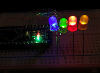

# JLed ESP-IDF example (PlatformIO)

[](https://github.com/jandelgado/jled-esp-idf-platformio-example/actions/workflows/test.yml)

This example shows how to use the embedded [JLed](https://github.com/jandelgado/jled) library 
with the ESP IDF framework and PlatformIO.



```c++
#include <jled.h>

extern "C" void app_main(void);

void app_main(void)
{
    auto led = JLed(LED_PIN).Breathe(1500).Forever();

    while(1) {
        led.Update();
    }
}
```

## Build

### Using PlatformIO

* Prerequisite: [PlatformIO](https://platformio.org/) installed
* Inspect the [platformio.ini](platformio.ini) file and adjust the `LED_PIN`
  `#define` to your needs (GPIO where a LED is connected, e.g. `2` for the
  builtin LED of the ESP-WROOM-32 board).

The following commands are used to configure, build and flash the image:
* run `pio build` to compile the example
* run `pio run -t upload` to flash the example on an ESP32
* optionally run `pio run -t menuconfig` to configure the image (see
  (sdkconfig.esp32dev)[sdkconfig.esp32dev])
* run `pio run -t clean` to clean up intermediary files

## References

* https://docs.platformio.org/en/latest/frameworks/espidf.html

## Author and License

(C) Copyright 2022 by Jan Delgado, License: MIT

